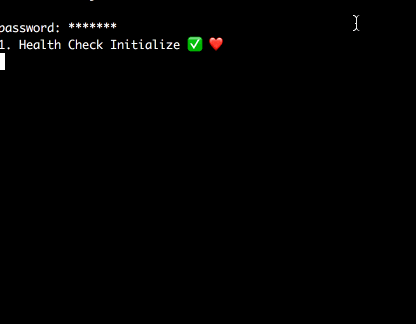

# Web Automotor
_powered by [Puppetter](https://github.com/GoogleChrome/puppeteer)_

## What is it?

It essentally operates like a userscript manager ([greasemonkey](https://en.wikipedia.org/wiki/Greasemonkey)) but on your local machine in a headless browser environment. For anonymity the the MAC is spoofed.  

## 🤖


## Getting Started

1. Clone the repo: `git clone git@github.com:Julian-Jurai/WebAutomator.git`
2. `npm start`
3. Enter password, this will be used if network interface modifcations are required for your automation purposes
4. Create a file the file: `src/lib/greaseMonkeyScript.js`
5. Enter your script as you would in any userscript manager but without immediate invokcation and it must include an export metadata object with the following properties:
   - `SSID`
   - `completedUrl`: usedd as a trigger for stopping the automation script

Example:

```javascript
export const metadata = {SSID: 'my_wifi', completedUrl: 'www.example.com/finished'}

export default function automate_stuff(){
  ...
}
```
